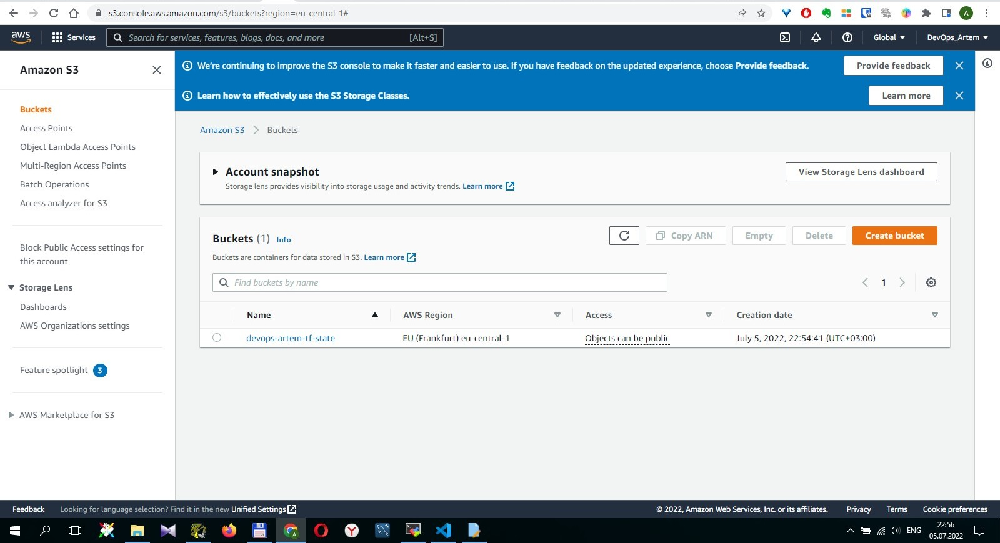

# Домашнее задание к занятию "7.3. Основы и принцип работы Терраформ"

## Задача 1. Создадим бэкэнд в S3 (необязательно, но крайне желательно).

Если в рамках предыдущего задания у вас уже есть аккаунт AWS, то давайте продолжим знакомство со взаимодействием терраформа и aws.

1. Создайте s3 бакет, iam роль и пользователя от которого будет работать терраформ. Можно создать отдельного пользователя, а можно использовать созданного в рамках предыдущего задания, просто добавьте ему необходимы права, как описано [здесь](https://www.terraform.io/docs/backends/types/s3.html).
2. Зарегистрируйте бэкэнд в терраформ проекте как описано по ссылке выше.

## Задача 2. Инициализируем проект и создаем воркспейсы.

1. Выполните `terraform init`:
   * если был создан бэкэнд в S3, то терраформ создат файл стейтов в S3 и запись в таблице dynamodb.
   * иначе будет создан локальный файл со стейтами.
2. Создайте два воркспейса `stage` и `prod`.
3. В уже созданный `aws_instance` добавьте зависимость типа инстанса от вокспейса, что бы в разных ворскспейсах использовались разные `instance_type`.
4. Добавим `count`. Для `stage` должен создаться один экземпляр `ec2`, а для `prod` два.
5. Создайте рядом еще один `aws_instance`, но теперь определите их количество при помощи `for_each`, а не `count`.
6. Что бы при изменении типа инстанса не возникло ситуации, когда не будет ни одного инстанса добавьте параметр жизненного цикла `create_before_destroy = true` в один из рессурсов `aws_instance`.
7. При желании поэкспериментируйте с другими параметрами и рессурсами.

В виде результата работы пришлите:

* Вывод команды `terraform workspace list`.
* Вывод команды `terraform plan` для воркспейса `prod`.

*Решение:*



```
root@cadcixztkv:~/hw-terraform-basic/s3# terraform workspace list
  default
* prod
  stage

root@cadcixztkv:~/hw-terraform-basic/s3# terraform plan

Terraform used the selected providers to generate the following execution plan. Resource actions are indicated with
the following symbols:
  + create

Terraform will perform the following actions:

  # aws_instance.ForEach["count"] will be created
  + resource "aws_instance" "ForEach" {
      + ami                                  = "ami-065deacbcaac64cf2"
      + arn                                  = (known after apply)
      + associate_public_ip_address          = (known after apply)
      + availability_zone                    = (known after apply)
      + cpu_core_count                       = (known after apply)
      + cpu_threads_per_core                 = (known after apply)
      + disable_api_stop                     = (known after apply)
      + disable_api_termination              = (known after apply)
      + ebs_optimized                        = (known after apply)
      + get_password_data                    = false
      + host_id                              = (known after apply)
      + id                                   = (known after apply)
      + instance_initiated_shutdown_behavior = (known after apply)
      + instance_state                       = (known after apply)
      + instance_type                        = "t2.micro"
      + ipv6_address_count                   = (known after apply)
      + ipv6_addresses                       = (known after apply)
      + key_name                             = (known after apply)
      + monitoring                           = (known after apply)
      + outpost_arn                          = (known after apply)
      + password_data                        = (known after apply)
      + placement_group                      = (known after apply)
      + placement_partition_number           = (known after apply)
      + primary_network_interface_id         = (known after apply)
      + private_dns                          = (known after apply)
      + private_ip                           = (known after apply)
      + public_dns                           = (known after apply)
      + public_ip                            = (known after apply)
      + secondary_private_ips                = (known after apply)
      + security_groups                      = (known after apply)
      + source_dest_check                    = true
      + subnet_id                            = (known after apply)
      + tags_all                             = (known after apply)
      + tenancy                              = (known after apply)
      + user_data                            = (known after apply)
      + user_data_base64                     = (known after apply)
      + user_data_replace_on_change          = false
      + vpc_security_group_ids               = (known after apply)

      + capacity_reservation_specification {
          + capacity_reservation_preference = (known after apply)

          + capacity_reservation_target {
              + capacity_reservation_id                 = (known after apply)
              + capacity_reservation_resource_group_arn = (known after apply)
            }
        }

      + ebs_block_device {
          + delete_on_termination = (known after apply)
          + device_name           = (known after apply)
          + encrypted             = (known after apply)
          + iops                  = (known after apply)
          + kms_key_id            = (known after apply)
          + snapshot_id           = (known after apply)
          + tags                  = (known after apply)
          + throughput            = (known after apply)
          + volume_id             = (known after apply)
          + volume_size           = (known after apply)
          + volume_type           = (known after apply)
        }

      + enclave_options {
          + enabled = (known after apply)
        }

      + ephemeral_block_device {
          + device_name  = (known after apply)
          + no_device    = (known after apply)
          + virtual_name = (known after apply)
        }

      + maintenance_options {
          + auto_recovery = (known after apply)
        }

      + metadata_options {
          + http_endpoint               = (known after apply)
          + http_put_response_hop_limit = (known after apply)
          + http_tokens                 = (known after apply)
          + instance_metadata_tags      = (known after apply)
        }

      + network_interface {
          + delete_on_termination = (known after apply)
          + device_index          = (known after apply)
          + network_card_index    = (known after apply)
          + network_interface_id  = (known after apply)
        }

      + private_dns_name_options {
          + enable_resource_name_dns_a_record    = (known after apply)
          + enable_resource_name_dns_aaaa_record = (known after apply)
          + hostname_type                        = (known after apply)
        }

      + root_block_device {
          + delete_on_termination = (known after apply)
          + device_name           = (known after apply)
          + encrypted             = (known after apply)
          + iops                  = (known after apply)
          + kms_key_id            = (known after apply)
          + tags                  = (known after apply)
          + throughput            = (known after apply)
          + volume_id             = (known after apply)
          + volume_size           = (known after apply)
          + volume_type           = (known after apply)
        }
    }

  # aws_instance.hw-terraform-basic[0] will be created
  + resource "aws_instance" "hw-terraform-basic" {
      + ami                                  = "ami-065deacbcaac64cf2"
      + arn                                  = (known after apply)
      + associate_public_ip_address          = (known after apply)
      + availability_zone                    = (known after apply)
      + cpu_core_count                       = (known after apply)
      + cpu_threads_per_core                 = (known after apply)
      + disable_api_stop                     = (known after apply)
      + disable_api_termination              = (known after apply)
      + ebs_optimized                        = (known after apply)
      + get_password_data                    = false
      + host_id                              = (known after apply)
      + id                                   = (known after apply)
      + instance_initiated_shutdown_behavior = (known after apply)
      + instance_state                       = (known after apply)
      + instance_type                        = "t2.micro"
      + ipv6_address_count                   = (known after apply)
      + ipv6_addresses                       = (known after apply)
      + key_name                             = (known after apply)
      + monitoring                           = (known after apply)
      + outpost_arn                          = (known after apply)
      + password_data                        = (known after apply)
      + placement_group                      = (known after apply)
      + placement_partition_number           = (known after apply)
      + primary_network_interface_id         = (known after apply)
      + private_dns                          = (known after apply)
      + private_ip                           = (known after apply)
      + public_dns                           = (known after apply)
      + public_ip                            = (known after apply)
      + secondary_private_ips                = (known after apply)
      + security_groups                      = (known after apply)
      + source_dest_check                    = true
      + subnet_id                            = (known after apply)
      + tags_all                             = (known after apply)
      + tenancy                              = (known after apply)
      + user_data                            = (known after apply)
      + user_data_base64                     = (known after apply)
      + user_data_replace_on_change          = false
      + vpc_security_group_ids               = (known after apply)

      + capacity_reservation_specification {
          + capacity_reservation_preference = (known after apply)

          + capacity_reservation_target {
              + capacity_reservation_id                 = (known after apply)
              + capacity_reservation_resource_group_arn = (known after apply)
            }
        }

      + ebs_block_device {
          + delete_on_termination = (known after apply)
          + device_name           = (known after apply)
          + encrypted             = (known after apply)
          + iops                  = (known after apply)
          + kms_key_id            = (known after apply)
          + snapshot_id           = (known after apply)
          + tags                  = (known after apply)
          + throughput            = (known after apply)
          + volume_id             = (known after apply)
          + volume_size           = (known after apply)
          + volume_type           = (known after apply)
        }

      + enclave_options {
          + enabled = (known after apply)
        }

      + ephemeral_block_device {
          + device_name  = (known after apply)
          + no_device    = (known after apply)
          + virtual_name = (known after apply)
        }

      + maintenance_options {
          + auto_recovery = (known after apply)
        }

      + metadata_options {
          + http_endpoint               = (known after apply)
          + http_put_response_hop_limit = (known after apply)
          + http_tokens                 = (known after apply)
          + instance_metadata_tags      = (known after apply)
        }

      + network_interface {
          + delete_on_termination = (known after apply)
          + device_index          = (known after apply)
          + network_card_index    = (known after apply)
          + network_interface_id  = (known after apply)
        }

      + private_dns_name_options {
          + enable_resource_name_dns_a_record    = (known after apply)
          + enable_resource_name_dns_aaaa_record = (known after apply)
          + hostname_type                        = (known after apply)
        }

      + root_block_device {
          + delete_on_termination = (known after apply)
          + device_name           = (known after apply)
          + encrypted             = (known after apply)
          + iops                  = (known after apply)
          + kms_key_id            = (known after apply)
          + tags                  = (known after apply)
          + throughput            = (known after apply)
          + volume_id             = (known after apply)
          + volume_size           = (known after apply)
          + volume_type           = (known after apply)
        }
    }

  # aws_instance.hw-terraform-basic[1] will be created
  + resource "aws_instance" "hw-terraform-basic" {
      + ami                                  = "ami-065deacbcaac64cf2"
      + arn                                  = (known after apply)
      + associate_public_ip_address          = (known after apply)
      + availability_zone                    = (known after apply)
      + cpu_core_count                       = (known after apply)
      + cpu_threads_per_core                 = (known after apply)
      + disable_api_stop                     = (known after apply)
      + disable_api_termination              = (known after apply)
      + ebs_optimized                        = (known after apply)
      + get_password_data                    = false
      + host_id                              = (known after apply)
      + id                                   = (known after apply)
      + instance_initiated_shutdown_behavior = (known after apply)
      + instance_state                       = (known after apply)
      + instance_type                        = "t2.micro"
      + ipv6_address_count                   = (known after apply)
      + ipv6_addresses                       = (known after apply)
      + key_name                             = (known after apply)
      + monitoring                           = (known after apply)
      + outpost_arn                          = (known after apply)
      + password_data                        = (known after apply)
      + placement_group                      = (known after apply)
      + placement_partition_number           = (known after apply)
      + primary_network_interface_id         = (known after apply)
      + private_dns                          = (known after apply)
      + private_ip                           = (known after apply)
      + public_dns                           = (known after apply)
      + public_ip                            = (known after apply)
      + secondary_private_ips                = (known after apply)
      + security_groups                      = (known after apply)
      + source_dest_check                    = true
      + subnet_id                            = (known after apply)
      + tags_all                             = (known after apply)
      + tenancy                              = (known after apply)
      + user_data                            = (known after apply)
      + user_data_base64                     = (known after apply)
      + user_data_replace_on_change          = false
      + vpc_security_group_ids               = (known after apply)

      + capacity_reservation_specification {
          + capacity_reservation_preference = (known after apply)

          + capacity_reservation_target {
              + capacity_reservation_id                 = (known after apply)
              + capacity_reservation_resource_group_arn = (known after apply)
            }
        }

      + ebs_block_device {
          + delete_on_termination = (known after apply)
          + device_name           = (known after apply)
          + encrypted             = (known after apply)
          + iops                  = (known after apply)
          + kms_key_id            = (known after apply)
          + snapshot_id           = (known after apply)
          + tags                  = (known after apply)
          + throughput            = (known after apply)
          + volume_id             = (known after apply)
          + volume_size           = (known after apply)
          + volume_type           = (known after apply)
        }

      + enclave_options {
          + enabled = (known after apply)
        }

      + ephemeral_block_device {
          + device_name  = (known after apply)
          + no_device    = (known after apply)
          + virtual_name = (known after apply)
        }

      + maintenance_options {
          + auto_recovery = (known after apply)
        }

      + metadata_options {
          + http_endpoint               = (known after apply)
          + http_put_response_hop_limit = (known after apply)
          + http_tokens                 = (known after apply)
          + instance_metadata_tags      = (known after apply)
        }

      + network_interface {
          + delete_on_termination = (known after apply)
          + device_index          = (known after apply)
          + network_card_index    = (known after apply)
          + network_interface_id  = (known after apply)
        }

      + private_dns_name_options {
          + enable_resource_name_dns_a_record    = (known after apply)
          + enable_resource_name_dns_aaaa_record = (known after apply)
          + hostname_type                        = (known after apply)
        }

      + root_block_device {
          + delete_on_termination = (known after apply)
          + device_name           = (known after apply)
          + encrypted             = (known after apply)
          + iops                  = (known after apply)
          + kms_key_id            = (known after apply)
          + tags                  = (known after apply)
          + throughput            = (known after apply)
          + volume_id             = (known after apply)
          + volume_size           = (known after apply)
          + volume_type           = (known after apply)
        }
    }

  # aws_s3_bucket.terraform_state will be created
  + resource "aws_s3_bucket" "terraform_state" {
      + acceleration_status         = (known after apply)
      + acl                         = (known after apply)
      + arn                         = (known after apply)
      + bucket                      = "devops-artem-tf-state-prod"
      + bucket_domain_name          = (known after apply)
      + bucket_regional_domain_name = (known after apply)
      + force_destroy               = false
      + hosted_zone_id              = (known after apply)
      + id                          = (known after apply)
      + object_lock_enabled         = (known after apply)
      + policy                      = (known after apply)
      + region                      = (known after apply)
      + request_payer               = (known after apply)
      + tags                        = {
          + "Name" = "Bucket"
        }
      + tags_all                    = {
          + "Name" = "Bucket"
        }
      + website_domain              = (known after apply)
      + website_endpoint            = (known after apply)

      + cors_rule {
          + allowed_headers = (known after apply)
          + allowed_methods = (known after apply)
          + allowed_origins = (known after apply)
          + expose_headers  = (known after apply)
          + max_age_seconds = (known after apply)
        }

      + grant {
          + id          = (known after apply)
          + permissions = (known after apply)
          + type        = (known after apply)
          + uri         = (known after apply)
        }

      + lifecycle_rule {
          + abort_incomplete_multipart_upload_days = (known after apply)
          + enabled                                = (known after apply)
          + id                                     = (known after apply)
          + prefix                                 = (known after apply)
          + tags                                   = (known after apply)

          + expiration {
              + date                         = (known after apply)
              + days                         = (known after apply)
              + expired_object_delete_marker = (known after apply)
            }

          + noncurrent_version_expiration {
              + days = (known after apply)
            }

          + noncurrent_version_transition {
              + days          = (known after apply)
              + storage_class = (known after apply)
            }

          + transition {
              + date          = (known after apply)
              + days          = (known after apply)
              + storage_class = (known after apply)
            }
        }

      + logging {
          + target_bucket = (known after apply)
          + target_prefix = (known after apply)
        }

      + object_lock_configuration {
          + object_lock_enabled = (known after apply)

          + rule {
              + default_retention {
                  + days  = (known after apply)
                  + mode  = (known after apply)
                  + years = (known after apply)
                }
            }
        }

      + replication_configuration {
          + role = (known after apply)

          + rules {
              + delete_marker_replication_status = (known after apply)
              + id                               = (known after apply)
              + prefix                           = (known after apply)
              + priority                         = (known after apply)
              + status                           = (known after apply)

              + destination {
                  + account_id         = (known after apply)
                  + bucket             = (known after apply)
                  + replica_kms_key_id = (known after apply)
                  + storage_class      = (known after apply)

                  + access_control_translation {
                      + owner = (known after apply)
                    }

                  + metrics {
                      + minutes = (known after apply)
                      + status  = (known after apply)
                    }

                  + replication_time {
                      + minutes = (known after apply)
                      + status  = (known after apply)
                    }
                }

              + filter {
                  + prefix = (known after apply)
                  + tags   = (known after apply)
                }

              + source_selection_criteria {
                  + sse_kms_encrypted_objects {
                      + enabled = (known after apply)
                    }
                }
            }
        }

      + server_side_encryption_configuration {
          + rule {
              + bucket_key_enabled = (known after apply)

              + apply_server_side_encryption_by_default {
                  + kms_master_key_id = (known after apply)
                  + sse_algorithm     = (known after apply)
                }
            }
        }

      + versioning {
          + enabled    = (known after apply)
          + mfa_delete = (known after apply)
        }

      + website {
          + error_document           = (known after apply)
          + index_document           = (known after apply)
          + redirect_all_requests_to = (known after apply)
          + routing_rules            = (known after apply)
        }
    }

Plan: 4 to add, 0 to change, 0 to destroy.

─────────────────────────────────────────────────────────────────────────────────────────────────────────────────────

Note: You didn't use the -out option to save this plan, so Terraform can't guarantee to take exactly these actions if
you run "terraform apply" now.

```
